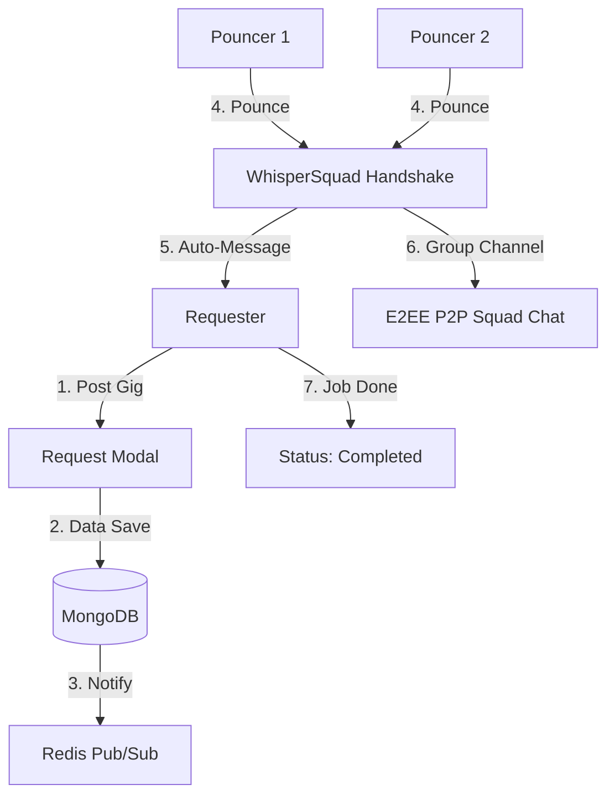

# PROJECT_OVERVIEW.md - Pounce 🐾

## 🏗 Architecture & Flow Diagram

## 🔐 WhisperChat & The "First Pounce" Flow 
WhisperChat is more than just messaging; it's a secure handshake. 
1. **The Pounce Action:** Clicking "Pounce" creates a new conversation and redirects the user directly to the chat interface.
2. **Auto-Initialization:** The Pouncer's browser automatically sends their **Custom Auto-Message** (e.g., *"Hi! I'm [Name] from [College]..."*) as soon as the E2EE handshake is complete.
3. **E2EE Handshake:** Clients use **ECDH (P-256)** to derive a shared secret. Key pairs are persisted in **IndexedDB** to ensure continuity across sessions.
4. **History Persistence:** Encrypted payloads (IV + Ciphertext) are stored on the server in the `Messages` collection. The server remains blind to the content, while clients fetch and decrypt history upon joining.
5. **Finalization:** The Requester marks jobs as "Done/Paid," updating MongoDB and triggering a "Payment Confirmed" visual for all squad members.

## 🔐 WhisperSquad: Group E2EE
1. **The Handshake:** When a Pouncer joins a "Squad," they perform a WebRTC-ready handshake with the Requester.
2. **Relay Logic:** Sockets relay the encrypted payloads. Each member decrypts the data locally using their unique private key and the shared secret.
3. **Encryption:** AES-GCM 256-bit encryption ensures that data remains private and unreadable to the server or any unauthorized "Cat."

## 💾 Refined Database Strategy

### MongoDB (Persistence)
- **Users Collection:** `_id`, `name`, `msu_email`, `college`, `course`, `publicKey`, `auto_pounce_message`.
- **Gigs Collection:** `_id`, `requester_id`, `pouncer_ids[]`, `title`, `description`, `targeted_expertises`, `reward`, `status`.
- **Messages Collection:** `conversation_id`, `sender_id`, `encryptedPayload`, `timestamp`. Stores only encrypted hashes.

### Redis (Speed & Real-time)
- **Presence List:** Tracks online/offline status using a Redis Set (`online_users`). Updates are broadcasted globally via `user_status_change` events.
- **Real-time Feed:** Supports immediate "Live Ticker" updates when new gigs are posted.

## 🎓 Infinite Scroll & Live Feed Logic
The Dashboard uses a hybrid approach for efficiency:
1. **Initial Load:** Fetches the first 10-20 gigs for All, Recommended, Misc, and Random categories.
2. **Infinite Scroll:** Each carousel independently detects when a user is near the end and fetches the next page via `/api/gigs/feed`.
3. **Live Injection:** Socket events (`new_gig`) inject new tasks into the front of the carousels in real-time, using ID deduplication to prevent conflicts with paginated results.
