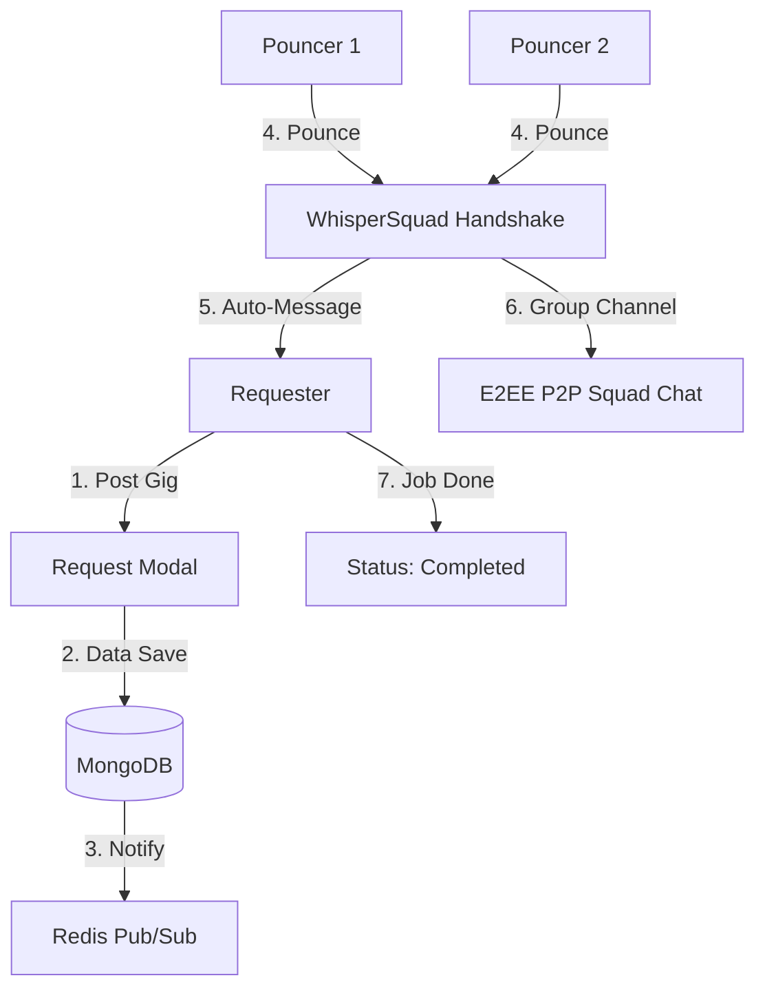

# PROJECT_OVERVIEW.md - Pounce 🐾

## 🏗 Architecture & Flow Diagram

## 🔐 WhisperChat & The "First Pounce" Flow 
WhisperChat is more than just messaging; it's a secure handshake. 
1. **The Pounce Action:** When a student clicks "Pounce" on a job, a WebSocket signal is sent to the requester.
2. **Auto-Initialization:** A new chat document is created. The Pouncer's browser automatically sends their **Custom Auto-Message** (e.g., *"Hi! I'm [Name] from CCS, I've done similar projects before. Let's talk!"*).
3. **P2P Establishment:** A WebRTC Data Channel is formed between the two users. All subsequent communication is P2P and encrypted.
4. **Finalization:** The Requester's chat view includes a **"Job Done/Paid"** button. Clicking this updates the Gig status in MongoDB and triggers a "Payment Confirmed" visual in the chat for both parties. 

## 🔐 WhisperSquad: Group E2EE
1. **The Handshake:** When a Pouncer joins a "Squad," they perform a WebRTC handshake with the Requester (the *Squad Leader*).
2. **Relay Logic:** For Group Chat, the Requester acts as a signaling node to ensure all Pouncers are synchronized.
3. **Encryption:** Each message is encrypted separately for each member of the Squad. Even with multiple "Cats" in the room, the data remains private and unreadable to the server.

## 💾 Refined Database Strategy

### MongoDB (Persistence)
- **Users Collection:** 
  - `_id`, `name`, `msu_email`, `college`, `course`, `skills[]`, `rating`.
  - `auto_pounce_message`: A user-editable string for their first message when pouncing.
- **Gigs Collection:** 
  - `_id`, `requester_id`, `pouncer_ids[]`: Array of students who have joined the squad.
  - `title`, `description` (max 500).
  - `images`: Array of up to 10 image URLs.
  - `targeted_expertises`: Array of Course IDs (supports multi-college targeting).
  - `reward`: Object containing `{ type: 'PHP' | 'CUSTOM', value: string }`.
  - `status`: `OPEN`, `IN_PROGRESS`, `COMPLETED`.

### Redis (Speed & Real-time)
- **Dashboard Feed:** Caches the "Top 5" for each carousel (All, Recommended, Misc, Random) to ensure near-instant loading.
- **Presence List:** Tracks which Cats are online to show a "Last active" status in chat.
- **Signaling:** Handles the "Offer/Answer" exchange for WebRTC.

## 🎓 Multi-Expertise Selection Logic
Requesters no longer choose a single college. Instead, the modal allows:
1. **Multi-Select College:** Choose one or more (e.g., *CCS* and *COET*).
2. **Filtered Course Checkbox:** Upon selecting a college, a list of its courses appears. The user can check as many as they want (e.g., *BS Computer Science* + *BS Mechanical Engineering*).
3. **Recommendation Engine:** The "Recommended Jobs" carousel for a Pouncer is filtered by matching these checked courses against the Pouncer's own degree program.
