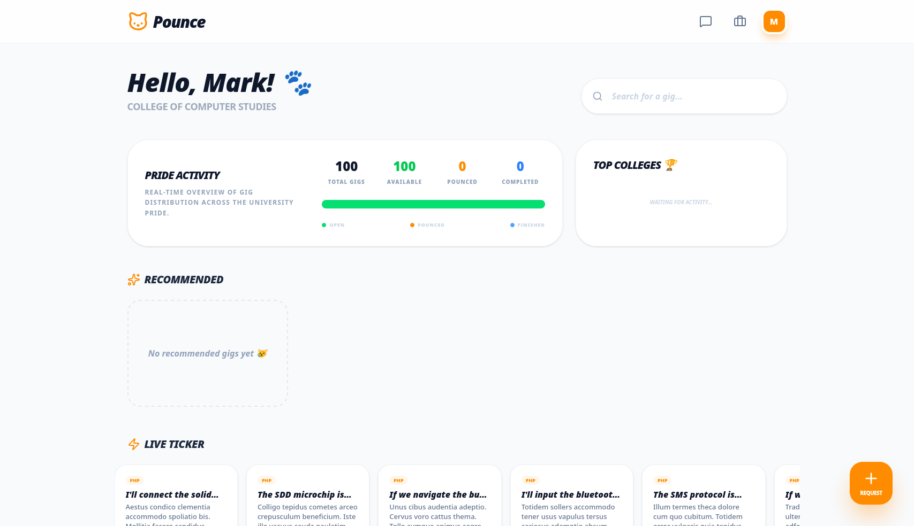
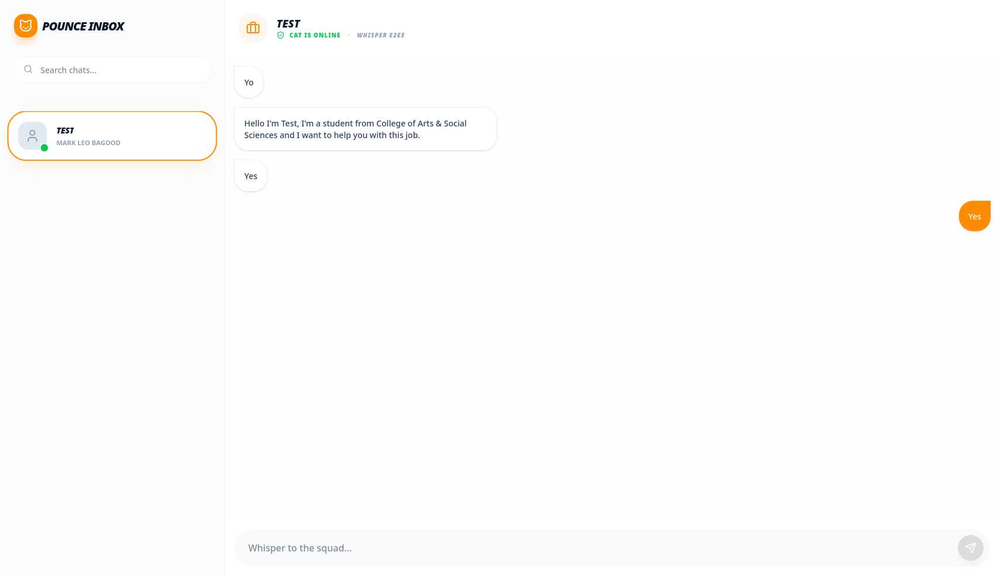

# Pounce: The Alab Gig Market 🐾 (v1.3.0-Release)

**Pounce** is a hyper-localized micro-task marketplace designed specifically for the **Mindanao State University - Iligan Institute of Technology (MSUIIT)** community. It connects students (the "CATS") who need tasks done with fellow students who have specialized expertise.

## 🐾 The Concept
In the MSUIIT ecosystem, every "Cat" has a specialty. **Pounce** allows students to post "Gigs" and target specific academic expertise. Supports **Squad Gigs** for team-based collaboration in a secure group environment.

## 🚀 Key Features
- **Online Deployment:** Fully hosted on **Vercel** (Frontend) and **Render** (Backend) with **MongoDB Atlas** for persistent storage.
- **The Pouncer Dashboard:** Categorized carousels with **Infinite Scrolling** and real-time feed injections.
- **WhisperSquad (Group E2EE):** Zero-knowledge, fully encrypted communication using ECDH P-256 + AES-GCM 256.
- **Admin Control Center:** Monitor account exclusive features including **Full JSON Database Backups** and **Marketplace Resets** (Seeding).
- **Self-Healing Bot Swarm:** Autonomous bots with deterministic identities that re-sync automatically after system resets.
- **Top Colleges Leaderboard:** Real-time visualization of academic activity via MongoDB aggregation pipelines.

## 📸 Screenshots

| Login | Sign Up |
|-------|---------|
|  |  |

| Dashboard | Gig Details |
|-----------|-------------|
|  |  |

| Chats | My Gigs |
|-------|---------|
|  |  |

## 🛠 Tech Stack
- **Frontend:** React (TypeScript/Vite), Framer Motion, Tailwind CSS, Lucide Icons.
- **Backend:** Node.js (Express), Socket.io (Real-time events).
- **Database:** MongoDB Atlas (Mongoose) with optimized indexing and complex aggregation.
- **Security:** JWT Authentication + Web Crypto API for End-to-End Encryption.

## 🌍 Live Deployment
- **Backend (Render):** `https://pounce-q51h.onrender.com`
- **Frontend (Vercel):** *[Your Vercel URL]*

## 🏁 Getting Started

### 1. Prerequisites
- **Node.js** (v18+)
- **MongoDB Atlas Connection**

### 2. Setup
```bash
npm install
```

### 3. Environment
```bash
# In server/ folder
cp .env.example .env
# Ensure MONGODB_URI and JWT_SECRET are set.
```

### 4. Launch (Local Dev)
```bash
./launch.sh
# OR
npm start
```

## 🤖 Advanced CLI Commands
- **`node server/populate.js`**: Populates the database with realistic students and gigs.
- **`npm run bot`**: Spawns 50+ autonomous bots for live marketplace simulation.

## 🎓 MSUIIT Colleges Covered
Includes all major colleges (CASS, COET, CSM, CED, CBAA, CCS, CHS) with complete program mapping.

---
*Created by Mark Leo Bagood for MSUIIT Pride. 🐾*
